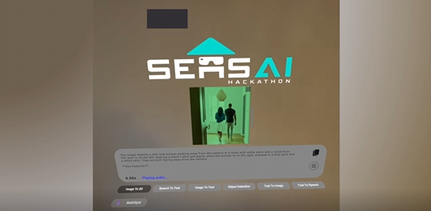

# XR AI Workbench

A Unity-based XR AI workbench built on Unity 6.2 (6000.2.0f1).

## Setup Instructions

### 1. Scene Setup
- Open the **XrAiScene** in Unity

### 2. Configure API Keys

*Register for all the AI providers and obtain API Keys*

Use `XrAiSecretsManager` to store secrets:

1. Navigate to your `Assets/Resources` folder.
2. If `XrAiSecretsManager` does not exist, right-click `Create -> XrAiAccelerator -> Secrets Manager`.
3. Click on the `XrAiSecretsManager` object and view the inspector.

**Add** a secret: enter the secret and click `Add`.

**Delete** a secret: click the `X` next to the secret.

**Edit** a secret: delete the secret and recreate it.

### 3. AI Provider Configuration
- Register for all the AI providers and obtain API Keys
- Enter the API Keys into the **XrAiSecretsManager**
- Save the Scene

For the built-in plugins use the following names for your API Keys in XrAiSecretsManager:

- "Nvidia" - https://build.nvidia.com/settings/api-keys
- "OpenAI" - https://platform.openai.com/account/api-keys
- "Google" - https://ai.google.dev/gemini-api/docs/api-key
- "Groq" - https://console.groq.com/keys
- "Roboflow" - https://docs.roboflow.com/developer/authentication/find-your-roboflow-api-key
- "StabilityAi" - https://platform.stability.ai/account/api-keys

For AWS - you need an ACCESS_KEY and SECRET_KEY - the value of the secret is <ACCESS_KEY>;<SECRET_KEY> - separated with ';'.
Use these names:

- "BedrockAnthropic"
- "BedrockTitan"
- "Polly"
- "RekognitionKeypoints"
- "Transcribe"

## Requirements
- Unity 6000.2.0f1
- Valid API Keys for AI providers
